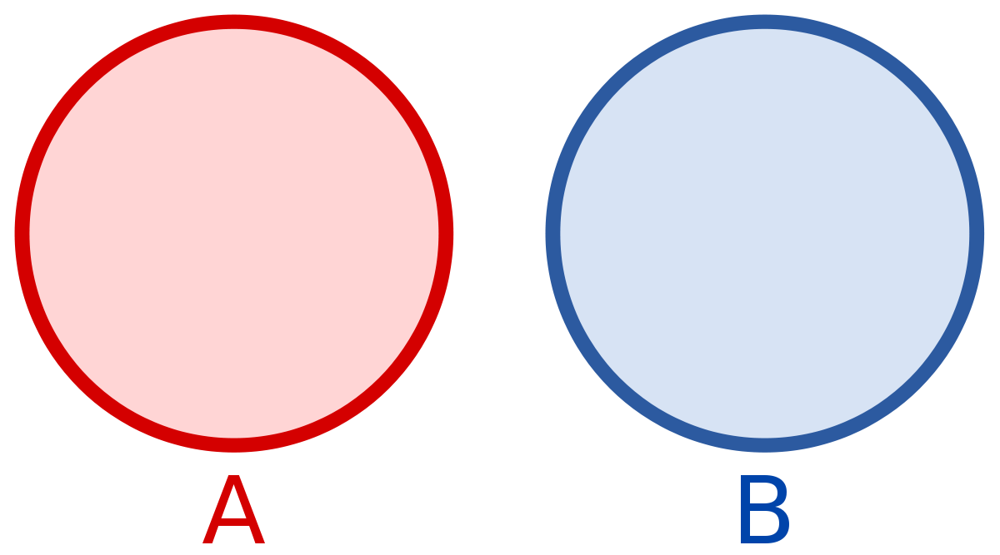

# Either

We will talk about Either and Validation data types.

## Disjoint union

An `Either<A,B>` models a disjoint union:

It is used to model a situation where something can be one of two types.

- `Int | String`
- `BasketItem | OrderItem`
- `Exception | A`

We'll get to the last one later.

## Crash course

- Construct an either - `Either.left(x)`, `Either.right(x)`
- `bimap` - transform each side of the `Either`, giving back a new `Either`
    - Either is a **bifunctor**
- Transform an `Either<A,B>` to a value of type `C`, given `f: A->B` and `g: A->C`
    - The catamorphism for eithers
- Left / Right projection
    - Apply transformations to the left / right side of an either
    - taking a value back from an either
        - value
        - orValue
    
    

